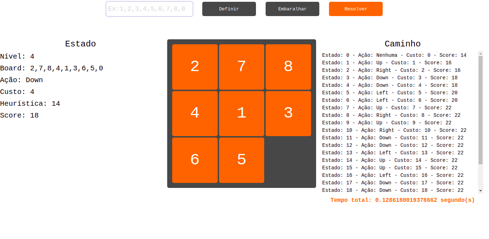

# Busca Heurística A* - 8's Puzzle
Este é um projeto que visa implementar um ambiente backend e frontend para um algoritmo de busca para uma solução do Jogos dos 8 (8s Puzzle).

   
   

   

   

   

   

## 🛠 Preparando o ambiente:

## 💻 Algoritmo A*:

## 📋 Meta
Jinyue Han (Reference)– [YouTube](https://www.youtube.com/channel/UCm_-D0nt_k2xXyMPwDmeVUA) – [Github](https://github.com/JaneHJY)